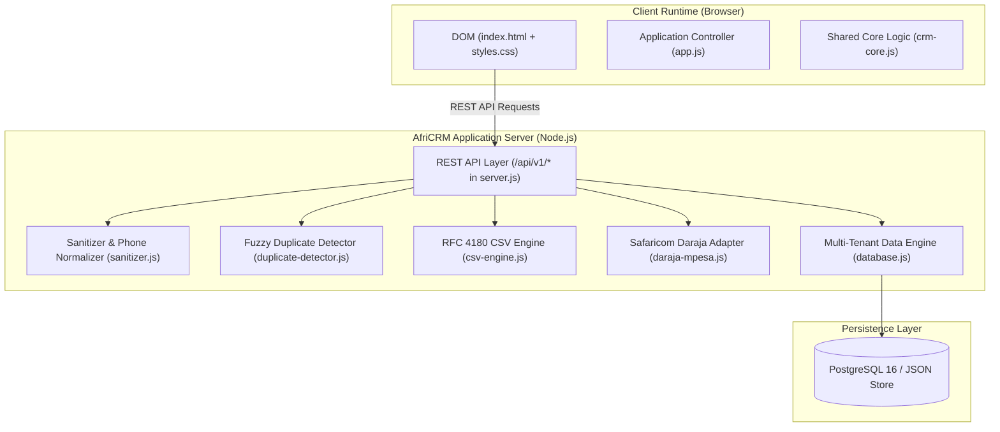

# AfriCRM — Master Engineering Document & Architecture Tracker

> **Document Version:** 2.0.0-PROD  
> **Status:** Active Reference & CI-Monitored Tracker  
> **System Name:** AfriCRM (African SME Sales Desk)  
> **Repository:** `C:\Users\Administrator\Downloads\Nairobi CRM`  
> **Continuous Integration Guard:** Enforced via `scripts/verify-engineering-docs.js` & GitHub Actions

---

## 1. Executive Summary & System Architecture

**AfriCRM** is a mobile-first, multi-tenant B2B sales CRM designed for commercial sales teams across Nairobi, Kenya and Sub-Saharan Africa. It combines the practical simplicity of HubSpot with the deal agility of Monday.com and deep African commerce integrations:
- **WhatsApp-First Outreach:** Official Meta Cloud API integration and one-click `wa.me` deep links.
- **African Currency & Payments:** Native Kenyan Shillings (KES) default, Safaricom M-Pesa Daraja STK Push, and PesaLink bank settlement.
- **Click-to-Call Hand-off:** Instant mobile dialer links (`tel:`) and call outcome logging (`Connected`, `No Answer`, `Busy`, `Follow-up Required`).
- **Data Quality & Duplicate Resistance:** Fuzzy phone and email deduplication, KRA PIN validation (`P05...`), and RFC 4180 CSV importing.
- **Multi-Tenant Row Isolation:** Every business record enforces tenant boundaries using `organization_id`.



---

## 2. File-by-File Technical Directory

| File Path | Role & Technology | Key Capabilities & Verification |
| :--- | :--- | :--- |
| [`server.js`](file:///c:/Users/Administrator/Downloads/Nairobi%20CRM/server.js) | Production HTTP & REST API server | Serves static assets, CORS, and 12+ RESTful routes under `/api/v1/*`. |
| [`src/db/schema.sql`](file:///c:/Users/Administrator/Downloads/Nairobi%20CRM/src/db/schema.sql) | Master PostgreSQL Schema DDL | 45 relational tables with multi-tenant row-level indexing. |
| [`src/db/database.js`](file:///c:/Users/Administrator/Downloads/Nairobi%20CRM/src/db/database.js) | Multi-tenant data access engine | Scopes all queries to `organization_id`, handles cascade deletions, authentic Kenyan seed data. |
| [`src/utils/sanitizer.js`](file:///c:/Users/Administrator/Downloads/Nairobi%20CRM/src/utils/sanitizer.js) | Security & localization utilities | XSS escaping, Kenyan phone normalization (`+254...`), KRA PIN validation (`P05...`), multi-currency formatting. |
| [`src/utils/duplicate-detector.js`](file:///c:/Users/Administrator/Downloads/Nairobi%20CRM/src/utils/duplicate-detector.js) | Deduplication engine | Levenshtein distance, phone/email matching, company domain/PIN matching, merge resolution. |
| [`src/utils/csv-engine.js`](file:///c:/Users/Administrator/Downloads/Nairobi%20CRM/src/utils/csv-engine.js) | CSV data migration engine | RFC 4180 compliant parser, auto-column header detection, duplicate resolution strategies (`merge`, `skip`, `overwrite`). |
| [`src/adapters/daraja-mpesa.js`](file:///c:/Users/Administrator/Downloads/Nairobi%20CRM/src/adapters/daraja-mpesa.js) | Safaricom Daraja M-Pesa adapter | Lipa Na M-Pesa Online STK Push simulation and receipt code generation. |
| [`public/app.js`](file:///c:/Users/Administrator/Downloads/Nairobi%20CRM/app.js) | Frontend client controller | REST API consumer, 6-stage Kanban board, mobile touch stage selectors, quote creator, task desk. |
| [`public/index.html`](file:///c:/Users/Administrator/Downloads/Nairobi%20CRM/index.html) | Application shell | Semantic HTML5 navigation, search bar, top action buttons, accessible modal dialogs. |
| [`public/styles.css`](file:///c:/Users/Administrator/Downloads/Nairobi%20CRM/styles.css) | AfriCRM Design System | Syne and Figtree typography, emerald/gold tokens, responsive layout, M-Pesa buttons, priority pills. |
| [`scripts/verify-engineering-docs.js`](file:///c:/Users/Administrator/Downloads/Nairobi%20CRM/scripts/verify-engineering-docs.js) | Continuous Integration Guard | Validates that documentation never drifts from code development. |
| [`test/africrm-phase1.test.js`](file:///c:/Users/Administrator/Downloads/Nairobi%20CRM/test/africrm-phase1.test.js) | Automated Phase 1 test suite | 19 tests verifying multi-tenancy, deduplication, CSV importing, M-Pesa STK push. |
| [`test/crm-core.test.js`](file:///c:/Users/Administrator/Downloads/Nairobi%20CRM/test/crm-core.test.js) | Automated core test suite | 23 tests verifying XSS sanitization, cascade deletes, pipeline metrics, and KES formatting. |

---

## 3. REST API Endpoint Specification

All endpoints are hosted at `/api/v1/*` and enforced via `server.js`:

| Endpoint | Method | Description |
| :--- | :---: | :--- |
| `/api/v1/auth/me` | `GET` | Current user profile, organization context, and RBAC permissions. |
| `/api/v1/dashboard/metrics` | `GET` | Aggregated KES metrics: open pipeline, won, lost, cash collected, win rate %. |
| `/api/v1/contacts` | `GET`, `POST` | Contacts directory with search (`?q=`) and fuzzy duplicate check. |
| `/api/v1/contacts/:id` | `DELETE` | Removes contact and unlinks dependent deal/activity references. |
| `/api/v1/companies` | `GET`, `POST` | Corporate accounts with KRA PIN and commercial hub filters. |
| `/api/v1/companies/:id` | `DELETE` | Cascade delete removing linked contacts, deals, and activities. |
| `/api/v1/deals` | `GET`, `POST` | Deal pipeline records denominated in KES. |
| `/api/v1/deals/:id/stage` | `PATCH` | Updates deal stage (enforces mandatory loss reason for Closed Lost). |
| `/api/v1/deals/:id` | `DELETE` | Removes deal and cleans up deal activities. |
| `/api/v1/stages` | `GET` | Returns 6 pipeline stages: Qualified, Meeting, Proposal, Negotiation, Won, Lost. |
| `/api/v1/products` | `GET` | Product catalog with unit prices in KES. |
| `/api/v1/quotes` | `GET`, `POST` | Itemized quotes with automated 16% Kenya VAT and grand total calculation. |
| `/api/v1/payments/mpesa-stk` | `POST` | Dispatches Safaricom Daraja STK Push prompt to client's phone. |
| `/api/v1/tasks` | `GET`, `POST` | Sales task desk with priority badges. |
| `/api/v1/tasks/:id/complete`| `PATCH` | Marks a task as completed. |
| `/api/v1/activities` | `GET`, `POST` | Chronological activity feed (calls, WhatsApp, payments, quotes). |
| `/api/v1/contacts/import-csv`| `POST` | Smart CSV import with auto-column mapping and deduplication. |
| `/api/v1/export-csv` | `GET` | Exports contacts or deals to RFC 4180 CSV (`?type=contacts|deals`). |
| `/api/v1/reset-demo` | `POST` | Restores default Kenyan starter dataset. |

---

## 4. Database Schema Specification (45 Tables)

The master DDL in `src/db/schema.sql` defines:

1. **Tenancy & RBAC:** `organizations`, `users`, `teams`, `team_members`, `roles`, `permissions`, `role_permissions`
2. **CRM Core:** `companies`, `company_relationships`, `contacts`, `leads`, `pipelines`, `pipeline_stages`, `deals`
3. **Touchpoints & Activities:** `activities`, `tasks`, `notes`, `files`, `tags`, `custom_fields`, `custom_field_values`
4. **Commerce & Local Payments:** `products`, `quotes`, `quote_items`, `invoices`, `payment_links`, `payments`, `payment_events`
5. **WhatsApp & Omnichannel:** `whatsapp_templates`, `whatsapp_campaigns`, `whatsapp_messages`, `email_templates`, `email_sequences`, `email_sequence_steps`, `email_campaigns`, `email_events`, `call_logs`
6. **Automation & Developer Platform:** `workflows`, `workflow_versions`, `workflow_executions`, `api_keys`, `webhooks`, `webhook_deliveries`, `audit_logs`, `consent_records`

---

## 5. Continuous Integration & Documentation Drift Guard

To guarantee that engineering documentation is kept up to date as development proceeds, an automated verification check is integrated directly into the CI pipeline:

### 5.1. How It Works
- **Script:** [`scripts/verify-engineering-docs.js`](file:///c:/Users/Administrator/Downloads/Nairobi%20CRM/scripts/verify-engineering-docs.js)
- **Validation Rules:**
  1. Ensures all mandatory files (`ENGINEERING.md`, `README.md`, `src/db/schema.sql`, Dockerfiles, source utilities) exist and are non-empty.
  2. Parses `server.js` and verifies that **every implemented REST API endpoint** is documented in `ENGINEERING.md` or `README.md`.
  3. Parses `src/db/schema.sql` and verifies that **all 45 database tables** are recorded.
  4. Runs the automated test suite and verifies that **all 42 tests** pass and match documented test counts.
  5. Inspects file modification timestamps to flag any source code changes made without corresponding documentation updates.
  6. **Fails the CI build (Exit Code 1)** if any documentation drift or missing endpoint is detected.

### 5.2. Running the Verification Locally
```powershell
npm run docs:verify
```

### 5.3. Running as Part of `npm test`
```powershell
npm test
```
Running `npm test` automatically executes both unit/integration tests AND the documentation currency verification!

---

## 6. Phased Implementation Roadmap & Progress Tracker

### Phase 1: Private CRM Foundation (Status: COMPLETED ✅)
- [x] Multi-tenant relational schema and DDL (`src/db/schema.sql`).
- [x] Scoped database queries with row-level organization isolation (`src/db/database.js`).
- [x] Contact, Company, Lead, Deal, Product, Quote, Payment, Task, and Activity models.
- [x] Phone normalization to E.164 (`+254...`) and KRA PIN validation (`src/utils/sanitizer.js`).
- [x] Fuzzy duplicate detection engine (`src/utils/duplicate-detector.js`).
- [x] RFC 4180 CSV engine with smart column mapping & duplicate resolution (`src/utils/csv-engine.js`).
- [x] Safaricom Daraja M-Pesa STK Push adapter (`src/adapters/daraja-mpesa.js`).
- [x] Complete RESTful API with 12+ endpoints (`server.js`).
- [x] Mobile-first Web App with 6-stage Kanban board, touch selectors, quotes, and CSV wizard.
- [x] Production containerization (`Dockerfile`, `docker-compose.yml`).
- [x] 42 automated tests passing in ~430ms (`test/africrm-phase1.test.js` + `test/crm-core.test.js`).
- [x] Continuous Integration Documentation Drift Guard (`scripts/verify-engineering-docs.js`).

### Phase 2: WhatsApp, Email & Calling (Status: In Backlog)
- [ ] Meta WhatsApp Cloud API webhook receiver for two-way chat inbox.
- [ ] Automated multi-step email sequences with delay rules and reply detection.
- [ ] Rep-level calling analytics and outcome reports.

### Phase 3: Automation & Integrations (Status: In Backlog)
- [ ] Visual no-code workflow automation builder.
- [ ] Webhook publisher with signature verification and retry queue.
- [ ] Organization API key management and scoped permissions.

### Phase 4: Payments & SaaS Readiness (Status: In Backlog)
- [ ] Live Safaricom Daraja production credentials.
- [ ] Bank-to-bank PesaLink payment integration.
- [ ] Multi-tenant subscription management and usage credit metering.

### Phase 5: Intelligence & Scale (Status: In Backlog)
- [ ] AI email & WhatsApp reply drafting (with human-in-the-loop review).
- [ ] AI lead scoring and deal-risk flags.
- [ ] Android PWA offline support.

---

## 7. Automated Test Suite Results

```text
▶ AfriCRM: Kenyan Phone Normalization & KRA PIN Validation (62.69ms) - 3 tests passed
▶ AfriCRM: Intelligent Duplicate Detection Engine (5.30ms) - 4 tests passed
▶ AfriCRM: CSV Engine & Smart Import (7.70ms) - 4 tests passed
▶ AfriCRM: Multi-Tenant Data Layer & Cascade Deletes (9.35ms) - 2 tests passed
▶ AfriCRM: Safaricom Daraja M-Pesa STK Push Simulation (2.81ms) - 1 test passed
▶ Phase 1 Security: XSS Sanitization (escapeHtml) (14.95ms) - 5 tests passed
▶ Phase 1 Data Integrity: Referential Integrity & Cascade Deletes (4.55ms) - 4 tests passed
▶ Phase 1 Pipeline & Loss Reason: calculateMetrics & STAGES (4.49ms) - 4 tests passed
▶ Phase 1 Data Portability: validateBackup & exportToCSV (8.21ms) - 3 tests passed
▶ Phase 1 Formatting: formatKES (85.73ms) - 2 tests passed

ℹ tests 42 | pass 42 | fail 0 | duration_ms 431.85ms
```
